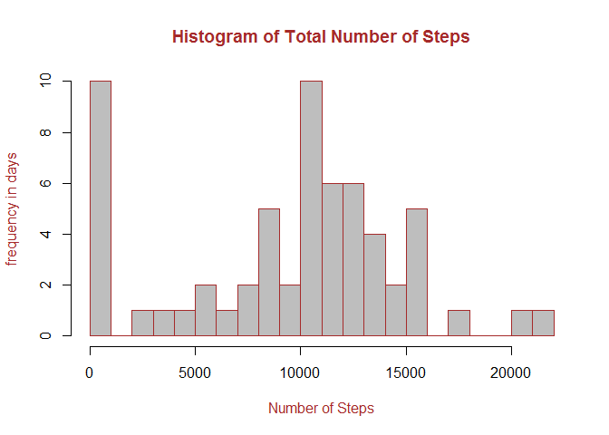
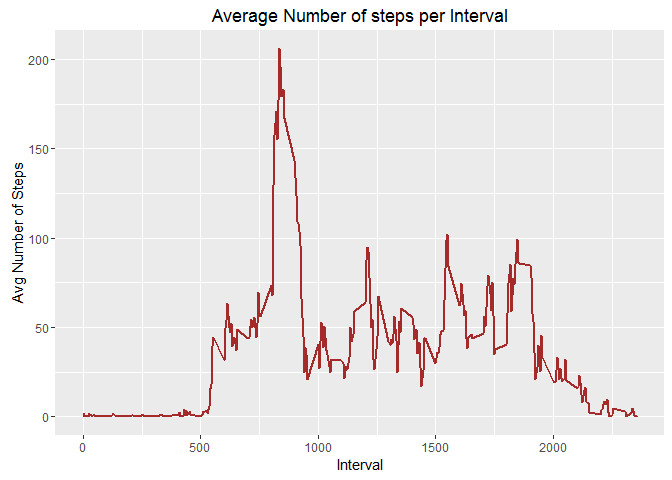
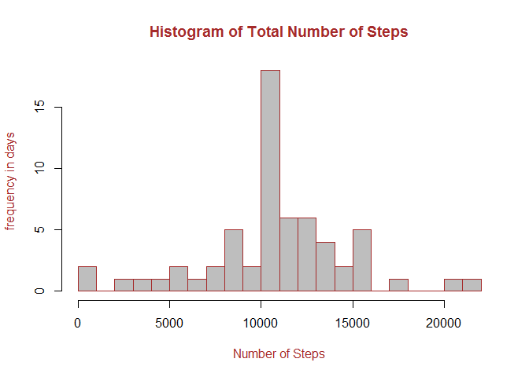
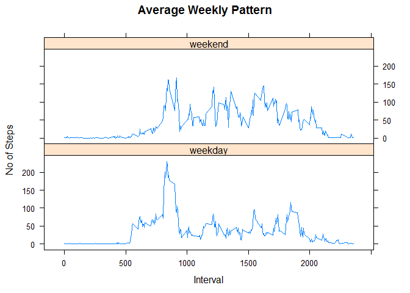

# Activity Data Analysis


This assignment makes use of data from a personal activity monitoring device. This device collects data at 5 minute intervals through out the day. The data consists of two months of data from an anonymous individual collected during the months of October and November, 2012 and include the number of steps taken in 5 minute intervals each day.

It is assumed that the dataset, activity.csv is available in the working directory.


##The Total Number of steps taken each Day


```r
  library(dplyr)
  library(xtable)
  
#read in the dataset  
activity <- read.csv(file="activity.csv",stringsAsFactors = FALSE)

activity <- transform(activity,date=as.Date(date,format="%Y-%m-%d"))

# convert to tbl_df and find the total,mean, median no of steps per day.
activitydf <- tbl_df(activity)
totaldf <- activitydf %>% group_by(date) %>% 
           summarise(Total = sum(steps, na.rm=TRUE),Mean = mean(steps), Median= median(steps))

totaldf$Mean[is.na(totaldf$Mean)] <- 0
totaldf$Median[is.na(totaldf$Median)] <- 0

# plot the histogram
with(totaldf,hist(Total,breaks = 20,col="grey",border="brown",xlab="Number of Steps",ylab="frequency in days",main="Histogram of Total Number of Steps",col.main="brown",col.lab="brown"))
```

<!-- -->

The Total, Mean and Median number of steps for each date is displayed below:


```r
#display the information
  print(totaldf,n=nrow(totaldf))
```

```
## Source: local data frame [61 x 4]
## 
##          date Total       Mean Median
##        (date) (int)      (dbl)  (dbl)
## 1  2012-10-01     0  0.0000000      0
## 2  2012-10-02   126  0.4375000      0
## 3  2012-10-03 11352 39.4166667      0
## 4  2012-10-04 12116 42.0694444      0
## 5  2012-10-05 13294 46.1597222      0
## 6  2012-10-06 15420 53.5416667      0
## 7  2012-10-07 11015 38.2465278      0
## 8  2012-10-08     0  0.0000000      0
## 9  2012-10-09 12811 44.4826389      0
## 10 2012-10-10  9900 34.3750000      0
## 11 2012-10-11 10304 35.7777778      0
## 12 2012-10-12 17382 60.3541667      0
## 13 2012-10-13 12426 43.1458333      0
## 14 2012-10-14 15098 52.4236111      0
## 15 2012-10-15 10139 35.2048611      0
## 16 2012-10-16 15084 52.3750000      0
## 17 2012-10-17 13452 46.7083333      0
## 18 2012-10-18 10056 34.9166667      0
## 19 2012-10-19 11829 41.0729167      0
## 20 2012-10-20 10395 36.0937500      0
## 21 2012-10-21  8821 30.6284722      0
## 22 2012-10-22 13460 46.7361111      0
## 23 2012-10-23  8918 30.9652778      0
## 24 2012-10-24  8355 29.0104167      0
## 25 2012-10-25  2492  8.6527778      0
## 26 2012-10-26  6778 23.5347222      0
## 27 2012-10-27 10119 35.1354167      0
## 28 2012-10-28 11458 39.7847222      0
## 29 2012-10-29  5018 17.4236111      0
## 30 2012-10-30  9819 34.0937500      0
## 31 2012-10-31 15414 53.5208333      0
## 32 2012-11-01     0  0.0000000      0
## 33 2012-11-02 10600 36.8055556      0
## 34 2012-11-03 10571 36.7048611      0
## 35 2012-11-04     0  0.0000000      0
## 36 2012-11-05 10439 36.2465278      0
## 37 2012-11-06  8334 28.9375000      0
## 38 2012-11-07 12883 44.7326389      0
## 39 2012-11-08  3219 11.1770833      0
## 40 2012-11-09     0  0.0000000      0
## 41 2012-11-10     0  0.0000000      0
## 42 2012-11-11 12608 43.7777778      0
## 43 2012-11-12 10765 37.3784722      0
## 44 2012-11-13  7336 25.4722222      0
## 45 2012-11-14     0  0.0000000      0
## 46 2012-11-15    41  0.1423611      0
## 47 2012-11-16  5441 18.8923611      0
## 48 2012-11-17 14339 49.7881944      0
## 49 2012-11-18 15110 52.4652778      0
## 50 2012-11-19  8841 30.6979167      0
## 51 2012-11-20  4472 15.5277778      0
## 52 2012-11-21 12787 44.3993056      0
## 53 2012-11-22 20427 70.9270833      0
## 54 2012-11-23 21194 73.5902778      0
## 55 2012-11-24 14478 50.2708333      0
## 56 2012-11-25 11834 41.0902778      0
## 57 2012-11-26 11162 38.7569444      0
## 58 2012-11-27 13646 47.3819444      0
## 59 2012-11-28 10183 35.3576389      0
## 60 2012-11-29  7047 24.4687500      0
## 61 2012-11-30     0  0.0000000      0
```

==========================================================================================


```r
 #summary info
  print(summary(totaldf))
```

```
##       date                Total            Mean           Median 
##  Min.   :2012-10-01   Min.   :    0   Min.   : 0.00   Min.   :0  
##  1st Qu.:2012-10-16   1st Qu.: 6778   1st Qu.:23.53   1st Qu.:0  
##  Median :2012-10-31   Median :10395   Median :36.09   Median :0  
##  Mean   :2012-10-31   Mean   : 9354   Mean   :32.48   Mean   :0  
##  3rd Qu.:2012-11-15   3rd Qu.:12811   3rd Qu.:44.48   3rd Qu.:0  
##  Max.   :2012-11-30   Max.   :21194   Max.   :73.59   Max.   :0
```


========================================================================================

##The Average Number of steps for each 5 minute interval


```r
  library(ggplot2)
# summarise the mean no of steps for each 5 minute interval
  intervaldf <- activitydf %>% group_by(interval) %>% summarise(Mean = mean(steps,na.rm=T))
  
  # plot the Average Number of steps for each interval
  ggplot(data=intervaldf,aes(interval,Mean)) + geom_line(color="brown",size=1) +
        labs(title="Average Number of steps per Interval",x="Interval",y="Avg Number of Steps")
```

<!-- -->

```r
  # display the interval with the maximum mean no of steps
  maxdf <- intervaldf %>% filter(interval,Mean==max(Mean))
  maxint <- maxdf$interval
```

**The interval with the maximum number of steps is, 835**


```r
maxdf
```

```
## Source: local data frame [1 x 2]
## 
##   interval     Mean
##      (int)    (dbl)
## 1      835 206.1698
```

==========================================================================


##Imputing Missing Values


```r
  # total no of NA values ( steps variable)
  naCount <- sum(is.na(activity$steps)) 
```
The Total number of'**NA**' values of the '**steps**' variable :  **2304**

The imputing strategy used :  The missing step values are replaced by the average no of steps for the particular interval. The 'intervaldf' data frame is used for this purpose.


```r
# imputing missing values with the mean for that particular interval
  imputedf <- inner_join(activitydf,intervaldf)
  index <- is.na(imputedf$steps)
  imputedf$steps[index] <- imputedf$Mean[index]
  imputedf$Mean <- NULL
  
  #find the total,mean, median no of steps per day
  imputetotaldf <- imputedf %>% group_by(date) %>% summarise(Total = sum(steps),Mean = mean(steps), Median= median(steps))
```

###Histogram showing the Total Number of steps across all days after imputing the values


```r
 # histogram after imputing
  with(imputetotaldf,hist(Total,breaks = 20,col="grey",border="brown",xlab="Number of Steps",ylab="frequency in days",
                    main="Histogram of Total Number of Steps",col.main="brown",col.lab="brown"))
```

<!-- -->

```r
 # display the summarised data
 # print(imputetotaldf,n=nrow(imputetotaldf))
   print(summary(imputetotaldf))
```

```
##       date                Total            Mean             Median      
##  Min.   :2012-10-01   Min.   :   41   Min.   : 0.1424   Min.   : 0.000  
##  1st Qu.:2012-10-16   1st Qu.: 9819   1st Qu.:34.0938   1st Qu.: 0.000  
##  Median :2012-10-31   Median :10766   Median :37.3826   Median : 0.000  
##  Mean   :2012-10-31   Mean   :10766   Mean   :37.3826   Mean   : 4.474  
##  3rd Qu.:2012-11-15   3rd Qu.:12811   3rd Qu.:44.4826   3rd Qu.: 0.000  
##  Max.   :2012-11-30   Max.   :21194   Max.   :73.5903   Max.   :34.113
```

**Imputing the missing values with the mean no of steps has resulted in an increase in the mean and median no of steps.**

Before Imputing, **Mean = 32.48 , Median = 36.09**

After Imputing,  **Mean = 37.38 , Median = 37.38**


==================================================================================================================


##Pattern Variation between Weekdays and Weekends


```r
  library(lattice)
  
# create the factor variable
  day <- c("Monday","Tuesday","Wednesday","Thursday","Friday")
  dayofweek <- weekdays(imputedf$date) %in% day
  dayofweek <- factor(dayofweek,levels=c(TRUE,FALSE),labels=c("weekday","weekend"))

  # adding the factor variable
  imputedf <- transform(imputedf,week=dayofweek)
  
  # find the mean no of steps for each interval and dayofweek 
  imputemean <- imputedf %>% group_by(week,interval) %>% summarise(mean=mean(steps))
  
  # find the mean no of steps for weekdays and weekend
  imputeweek <- imputedf %>% group_by(week) %>% summarise(Mean=mean(steps),Median=median(steps))
```

###The Panel Plot showing the mean no of steps for each interval on weekdays and weekends


```r
  # make a panel plot
  xyplot(mean ~ interval | week, data=imputemean,type="l",xlab="Interval",ylab="No of Steps",main="Average Weekly Pattern",layout=c(1,2))
```

<!-- -->

###The weekly Pattern:


```r
 # display the summary info
 imputeweek
```

```
## Source: local data frame [2 x 3]
## 
##      week     Mean Median
##    (fctr)    (dbl)  (dbl)
## 1 weekday 35.61058      0
## 2 weekend 42.36640      0
```

**The mean no of steps is more on weekends (42.37) as compared to weekdays (35.61)**


=====================================================================================================
